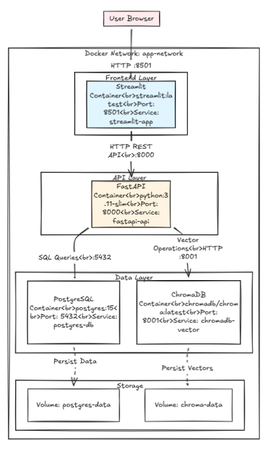

# Research Assistant API



## Overview

The Research Assistant API is a powerful FastAPI-based service that provides Retrieval Augmented Generation (RAG) capabilities for academic research. It combines document indexing, vector search, and AI-powered question answering to help researchers efficiently explore and analyze scientific literature, particularly from arXiv.

### Key Features

- **Document Processing**: Upload and index PDF and text documents
- **Vector Search**: Semantic search using sentence transformers and ChromaDB
- **AI-Powered Q&A**: Ask questions about your indexed documents using LLM integration
- **ArXiv Integration**: Fetch and index academic papers directly from arXiv
- **PostgreSQL Storage**: Persistent storage for articles and metadata
- **RESTful API**: Clean, documented API endpoints with authentication

## Architecture

The application follows a modular architecture:

```
app/
├── main.py              # FastAPI application entry point
├── config.py            # Configuration settings
├── api/
│   ├── main.py         # API router setup
│   ├── deps.py         # Dependencies (auth, etc.)
│   └── routes/
│       ├── rag.py      # RAG endpoints
│       └── data_fetcher.py  # ArXiv fetching endpoints
├── core/
│   ├── rag.py          # RAG core functionality
│   └── data_fetcher.py # ArXiv fetching logic
├── schemas/            # Pydantic models
├── utils/              # Database utilities and CRUD operations
└── prompts/            # LLM prompt templates
```

## Technology Stack

- **FastAPI**: Modern, fast web framework for building APIs
- **LangChain**: Framework for developing applications with LLMs
- **ChromaDB**: Vector database for embeddings
- **PostgreSQL**: Relational database for metadata storage
- **Sentence Transformers**: Text embedding models
- **OpenAI/Mistral**: Large Language Models for generation
- **ArXiv API**: Academic paper fetching
- **Docker**: Containerization

## Prerequisites

- Python 3.10+
- Docker and Docker Compose
- PostgreSQL
- ChromaDB
- OpenAI/Mistral API access

## Installation

### Using Docker (Recommended)

1. Clone the repository:
```bash
git clone <repository-url>
cd research-assistant-api
```

2. Create environment file:
```bash
cp .env.example .env
# Edit .env with your configuration
```

3. Build and run with Docker:
```bash
docker build -t research-assistant-api .
docker run -p 8000:8000 research-assistant-api
```

### Local Development

1. Install dependencies using uv:
```bash
pip install uv
uv sync
```

2. Set up environment variables in `.env`:
```env
OPENAI_MODEL=Mistral-Small
OPENAI_API_KEY=your-api-key
CHROMA_DB_HOST=localhost
CHROMA_DB_PORT=8001
PG_DB_HOST=localhost
PG_DB_PORT=5433
PG_DB_NAME=researcher_assistantdb
PG_DB_USER_NAME=appuser
PG_password=apppassword
```

3. Start the development server:
```bash
make run-fastapi-dev
# or
uv run fastapi dev app/main.py
```

## Database Setup

The application uses PostgreSQL for storing article metadata. Initialize the database:

```sql
-- Run the initialization script
psql -f init/init.sql
```

The application will automatically create necessary tables on startup.

## Configuration

Key configuration options in `app/config.py`:

- **LLM Settings**: API base URL, model name, API key
- **Database**: PostgreSQL connection settings
- **Vector Store**: ChromaDB host and port
- **Authentication**: Token-based authentication


## Development

### Project Structure

- **Core Logic**: Business logic in `app/core/`
- **API Routes**: HTTP endpoints in `app/api/routes/`
- **Data Models**: Pydantic schemas in `app/schemas/`
- **Database**: SQLAlchemy models and CRUD in `app/utils/`
- **Configuration**: Environment-based config in `app/config.py`

### Adding New Features

1. Define Pydantic schemas in `app/schemas/`
2. Implement core logic in `app/core/`
3. Create API routes in `app/api/routes/`
4. Add database models/CRUD if needed
5. Update documentation

## Authentication

The API uses token-based authentication. Include the token in requests:

```bash
# Header format
Authorization: Bearer YOUR_JWT_TOKEN
```

